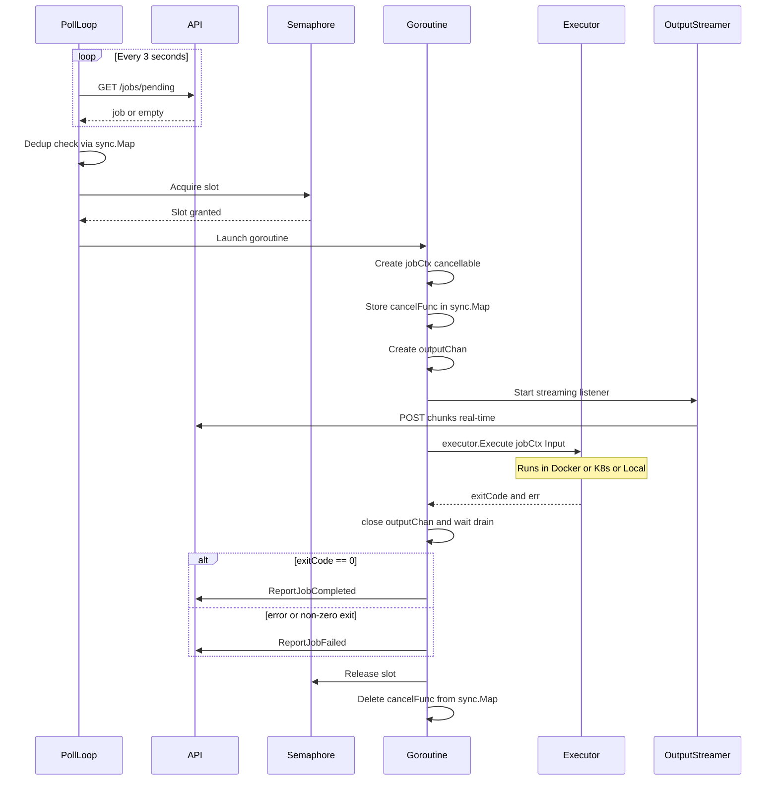
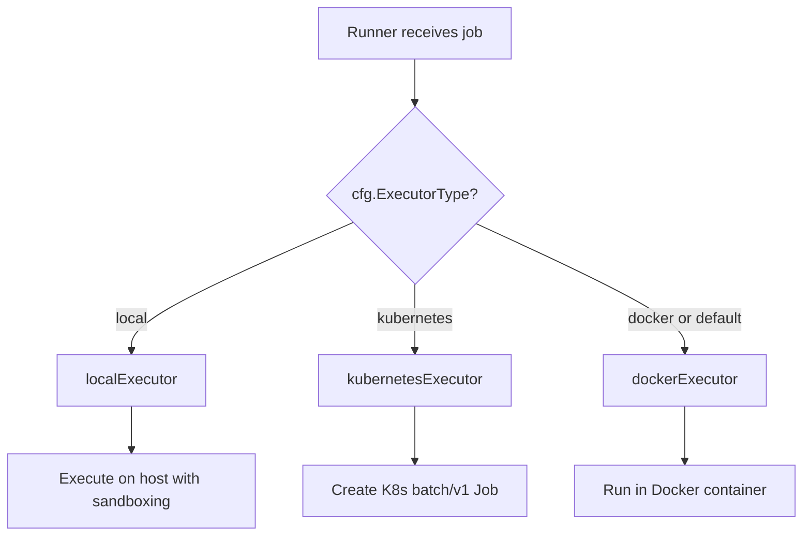
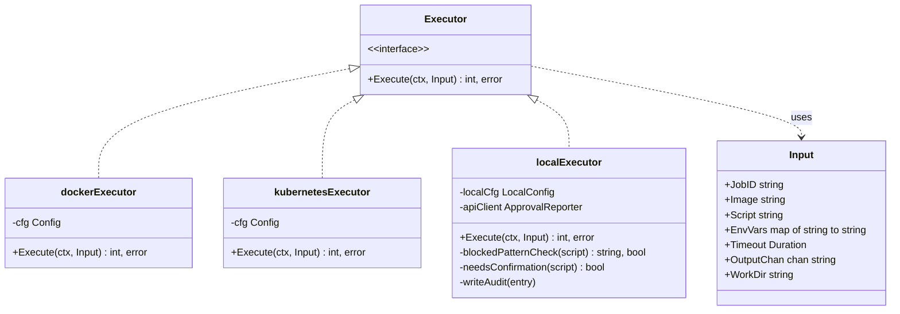
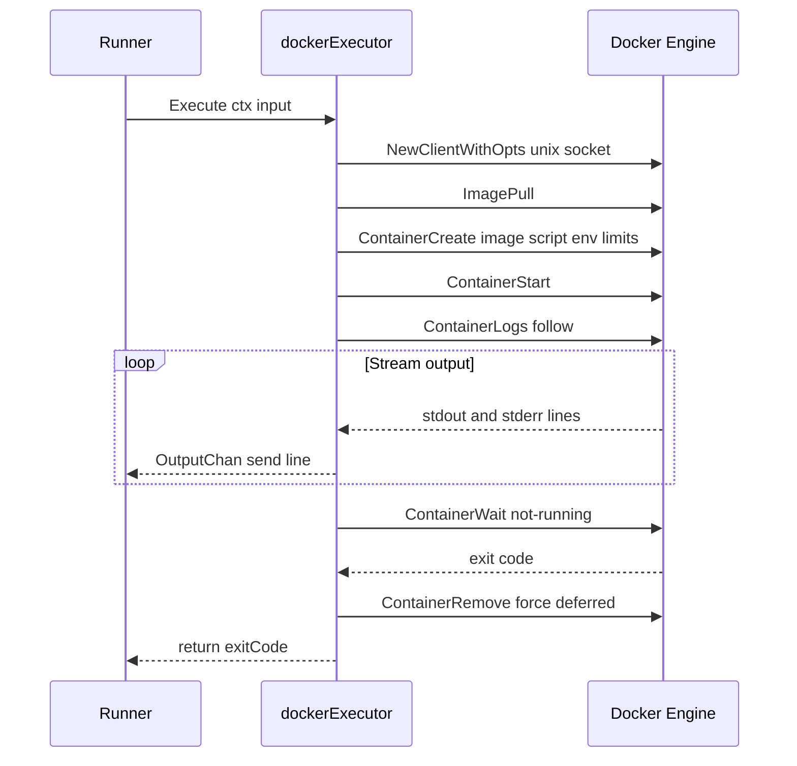
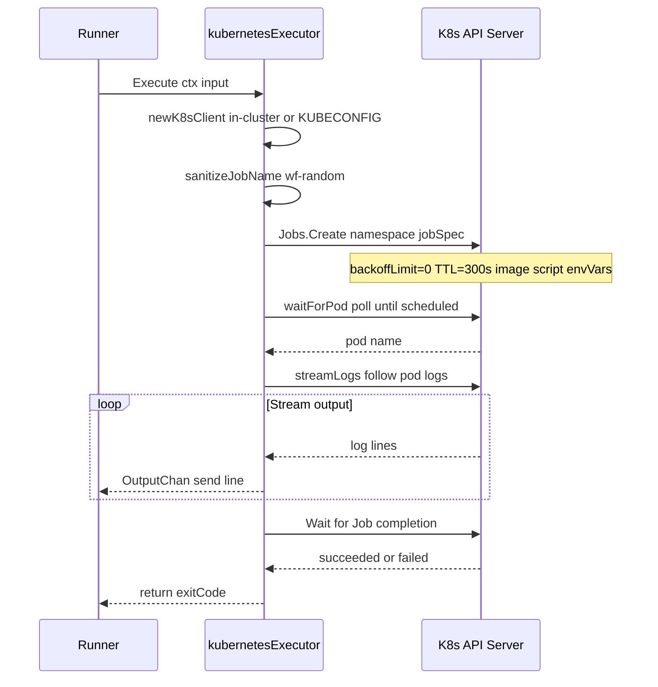
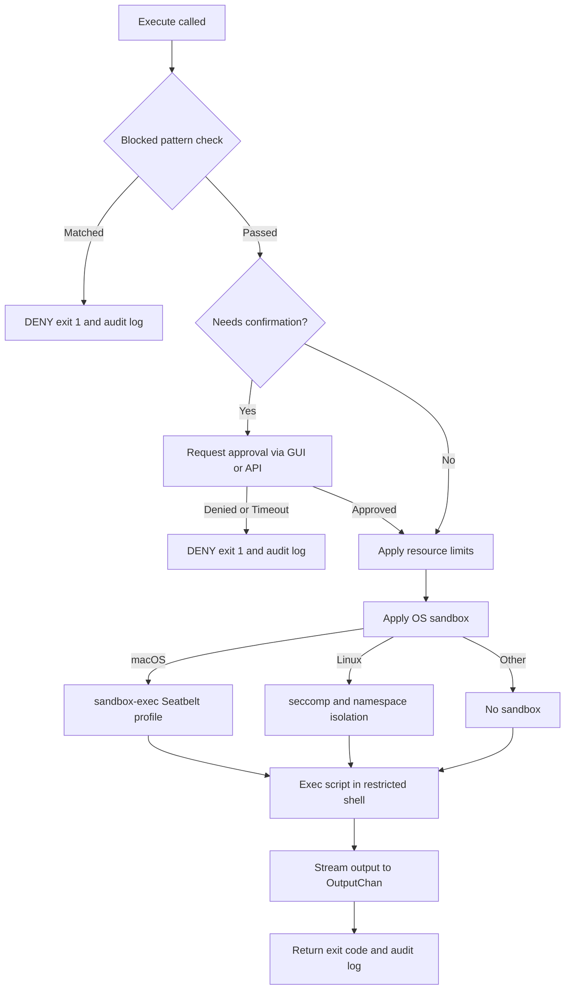

# WorkflowFiesta Runner — Knowledge, Decisions & Improvements

## Project Overview

A **self-hosted runner** for the WorkflowFiesta platform. It polls a central API for pending jobs, executes them in isolated environments (Docker containers, Kubernetes Jobs, or directly on the host), streams output back in real-time, and reports results. Supports both a headless CLI mode and a desktop GUI with system tray, approval popups, and a first-run registration wizard.

---

## Architecture

```
cmd/runner/main.go          CLI entry point (cobra commands)
internal/
  api/                      HTTP client for WorkflowFiesta API
  config/                   Global config (env vars + credentials file)
  executor/                 Job execution backends (Docker, Kubernetes, Local)
  localconfig/              YAML config for local executor mode
  localui/                  GUI layer (Fyne): tray, approval, wizard
  platform/                 OS-specific helpers
  runner/                   Core poll loop, heartbeat, job dispatch, git worktrees
```

### Key Interfaces

- **`executor.Executor`** — Strategy pattern: `Execute(ctx, Input) (exitCode, error)`
  - `dockerExecutor` — runs jobs in Docker containers via Docker Engine API
  - `kubernetesExecutor` — creates batch/v1 Jobs in a K8s cluster
  - `localExecutor` — runs scripts on the host with sandboxing & approval gates
- **`runner.StatusSink`** — Observer pattern for lifecycle events (CLI and GUI both implement)
- **`executor.ToolHandler`** — Dispatches structured tool calls (read_file, write_file, etc.)

### Concurrency Model

- Semaphore (`chan struct{}`, default capacity 4) limits concurrent jobs
- `sync.Map` for job deduplication (prevents same job running twice)
- Per-job `context.CancelFunc` stored in `sync.Map` for mid-flight cancellation
- Poll loop: 3s interval; Heartbeat: 30s interval

---

## Executor System

### Runner Job Dispatch Flow



### Executor Selection Flow



### Class Diagram



### Docker Executor Flow



### Kubernetes Executor Flow



### Local Executor Flow (Security Layers)



---

## Key Decisions

| Decision | Rationale |
|----------|-----------|
| HTTP polling (not WebSocket) | Simpler firewall/proxy compatibility; 3s poll is adequate for job latency |
| Build tags for GUI/headless split | `nolocalui` eliminates Fyne/CGO dependency for server deployments |
| Strategy pattern for executors | Clean separation; new backends (e.g., Firecracker) can be added without touching core |
| Git worktrees (not full clones) | Bare clone cache + detached worktrees = fast, isolated, disk-efficient |
| Native tool dispatch (in-process) | Avoids subprocess overhead for structured file operations |
| Layered security (local mode) | Blocked patterns -> approval gate -> ulimits -> OS sandbox (macOS/Linux) |
| SHA-256 fingerprints for "always allow" | Persisted approvals without storing full command text |
| `StatusSink` observer | Decouples runner logic from CLI/GUI presentation |
| Platform-specific sandbox files | Build constraints (`_darwin.go`, `_linux.go`) for OS-native isolation |
| Poll-based reconnection | `apiFailureThreshold = 2` before marking disconnected; auto-reconnects |

---

## Dependencies

| Dependency | Version | Purpose |
|---|---|---|
| `github.com/spf13/cobra` | v1.10.2 | CLI command framework |
| `github.com/sirupsen/logrus` | v1.9.4 | Structured logging |
| `github.com/docker/docker` | v28.5.2 | Docker Engine API client |
| `k8s.io/client-go` | v0.35.2 | Kubernetes Job creation |
| `fyne.io/fyne/v2` | v2.7.3 | Cross-platform desktop GUI |
| `gopkg.in/yaml.v3` | v3.0.1 | YAML config parsing |
| `golang.org/x/sys` | v0.42.0 | Low-level OS interfaces |

---

## Build Variants

| Variant | CGO | Build Tag | Use Case |
|---------|-----|-----------|----------|
| Headless | disabled | `nolocalui` | Servers, CI, Docker |
| GUI | enabled | (none) | Desktop with tray + wizard |

Platforms: Linux amd64, macOS amd64/arm64, Windows amd64

---

## Current Testing

- 12 test files across all packages
- Run with `go test ./...`
- CI: GitHub Actions (ubuntu-latest) with Fyne system deps installed
- `export_test.go` files expose internals for white-box testing

---

## Improvement Recommendations

### High Priority

1. **Add a Makefile** (done — see `Makefile`)
   - Standardize build, test, lint, docker commands
   - Embed version from git tags automatically
   - Cross-compilation targets for all platforms

2. **Add a linter (golangci-lint)** (done — see `.golangci.yml` + CI)
   - Configured: govet, errcheck, staticcheck, unused, gosimple, gocritic, errorlint, bodyclose, nilerr
   - Integrated into CI (golangci-lint-action) and Makefile (`make lint`)

3. **Structured logging fields** (done — `internal/runner/runner.go`)
   - All job handlers now use `log.WithField("job_id", id)` for correlated logs
   - Tool name and script name included as structured fields
   - `WithError(err)` used instead of `%v` formatting for errors

4. **Retry with exponential backoff** (done — `internal/api/client.go`)
   - `doWithRetry`: 3 attempts, exponential backoff (500ms base) with ±25% jitter
   - Retries on: network errors, 429, 502, 503, 504
   - Applied to: poll, heartbeat, output streaming, script library, all POST calls

5. **Graceful shutdown improvements**
   - Current: cancel context + signal
   - Add: drain in-flight jobs with configurable timeout before force-kill
   - Report "draining" status to API so platform doesn't reassign prematurely

6. **Health check endpoint**
   - Expose a lightweight HTTP `/healthz` endpoint for container orchestrators
   - Report ready state (API reachable + executor initialized)

### Medium Priority

7. **Configuration validation on startup**
   - Validate Docker socket reachable before entering poll loop
   - Validate K8s RBAC permissions upfront (can create Jobs, read Pods/Logs)
   - Fail fast with actionable error messages

8. **Metrics / observability**
   - Expose Prometheus metrics: jobs_total, jobs_failed, job_duration_seconds, poll_errors
   - OpenTelemetry deps already present (indirect); promote to direct usage
   - Add tracing spans for job execution lifecycle

9. **Integration tests**
   - No integration tests currently; only unit tests
   - Add Docker-based integration test: spin up mock API, submit job, verify output
   - Add testcontainers or docker-compose test harness

10. **Error wrapping consistency**
    - Mix of `fmt.Errorf("...: %w", err)` and bare error returns
    - Standardize on wrapping with `%w` for all error propagation
    - Enables `errors.Is()` / `errors.As()` downstream

### Low Priority

11. **Configuration file support (beyond env vars)**
    - Support TOML/YAML config file for non-local mode too
    - Precedence: flags > env vars > config file > defaults
    - Would simplify systemd deployments

12. **Binary size optimization**
    - Headless binary pulls in some unused indirect deps
    - Profile with `go build -gcflags='-m'` and trim dead code
    - Consider `upx` compression for release artifacts

13. **Auto-update mechanism**
    - Runners in the field can go stale
    - Add optional self-update check against GitHub releases API
    - Respect a "pinned version" config to prevent unwanted updates

14. **Documentation improvements**
    - `spec/` directory has good internal docs but no consolidated developer guide
    - Add `CONTRIBUTING.md` with build instructions, test guide, PR checklist
    - Add architecture diagram (Mermaid) to README

15. **Signal handling on Windows**
    - `syscall.SIGTERM` behaves differently on Windows
    - Add Windows-specific signal handling (console ctrl handler)
    - Test graceful shutdown on Windows

16. **Connection state machine**
    - Current reconnection logic uses a counter + mutex
    - Formalize as a state machine (disconnected -> connecting -> connected -> draining)
    - Makes UI updates and logging more predictable

---

## File Layout Conventions

- Platform-specific code: `*_{darwin,linux,windows,other}.go` with build constraints
- Test exports: `export_test.go` per package (exposes internals for test package)
- GUI stubs: `*_headless.go` with `//go:build nolocalui` tag
- Specs: `spec/` directory for design documents (not user-facing docs)
- CI: `.github/workflows/` for build and release pipelines

---

## Environment Variables

| Variable | Required | Default | Description |
|----------|----------|---------|-------------|
| `WORKFLOWFIESTA_TOKEN` | Yes | — | Runner authentication token |
| `WORKFLOWFIESTA_API_URL` | No | (hardcoded default) | API base URL |
| `WORKFLOWFIESTA_RUNNER_ID` | No | — | Runner UID (set after registration) |
| `WORKFLOWFIESTA_RUNNER_NAME` | No | hostname | Display name |
| `CONTAINER_RUNTIME` | No | auto-detect | Force executor type: docker/kubernetes/local |

---

## Security Model (Local Mode)

```
Command received
    |
    v
[Blocked patterns check] --> DENY (regex match on dangerous commands)
    |
    v
[Approval gate] --> DENY / ALLOW / ALLOW-SESSION / ALWAYS-ALLOW
    |
    v
[Resource limits] --> ulimit: max file size, max processes, CPU time
    |
    v
[OS sandbox]
    - macOS: sandbox-exec (Seatbelt profiles)
    - Linux: seccomp + namespace isolation
    - Windows: restricted token (future)
    |
    v
[Execute in restricted shell]
```

---

## Release Process

1. Create a GitHub release (tag `vX.Y.Z`)
2. CI builds 8 platform variants in parallel
3. Windows binaries signed with SSL.com CodeSignTool
4. macOS binaries signed with Apple codesign + notarized
5. All artifacts + SHA-256 checksums uploaded to the release
6. Publish step tolerates individual platform failures (ships what built)
